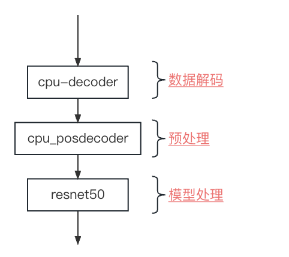

# torchpipe快速上手（30min体验版）

torchpipe是为工业界所准备的一个独立作用于底层加速库（如tensorrt，opencv，torchscript）以及 RPC（如thrift, gRPC）之间的多实例流水线并行库，助力使用者能在部署阶段节约更多的硬件资源，帮助产品应用落地。此教程主要针对初级用户，即对于加速相关的理论知识处于入门阶段，具有一定的 Python基础，能够阅读简单代码的用户。此内容主要包括使用torchpipe进行服务部署加速的使用方法、性能和效果差异对比等。


## 目录
* [1. 背景与基础知识介绍](#1)
* [2. 环境安装与配置](#2)
* [3. 加速案例---服务仅包含单模型，模型以resnet50为例](#3)
    * [3.1 使用TensorRT加速方案](#3.1)
    * [3.2 使用torchpipe的加速方案](#3.2)
* [4. 性能和效果对比](#4)


<a name='1'></a>

## 1.   背景与基础知识介绍

这几年深度学习发展迅猛，在图像、文本、语音等多个领域均取得了显著成果。目前已有一些模型加速技术通过计算、硬件优化等手段，提高深度学习模型推理速度，并在实际业务中取得不错成效。常见的有基于TensorRT、基于TVM加速等。本教程将以实际业务上线的过程中最简单的业务为例，介绍如何使用torchpipe完成线上服务部署的方法。整个服务仅有包含一个resnet50模型。整体服务链路流程如下所示：


我们对模型部署中需要了解到的一些概念做一些简单的解释，希望对初次体验torchpipe的你有所帮助，可详见[预备知识](./preliminaries)。


<a name='2'></a>

## 2.   环境安装与配置

具体安装步骤可详看[安装](installation.mdx), 我们提供了两种配置torchpipe环境的方法:
 - [使用NGC基础镜像并用源码进行编译。](installation.mdx#使用ngc基础镜像)
 - [自定义dockerfile，根据提供的命令更灵活的配置您的环境。](installation.mdx#ddddd)


<a name='3'></a>

## 3.  从 TensorRT 进阶到 torchpipe

本节将从使用TensorRT加速方案出发，给出服务部署时的常规加速方案，然后在此方案的基础上，使用torchpipe来进一步完成整个服务的加速优化。
<a name='3.1'></a>

### 3.1 使用TensorRT加速方案


TensorRT是一个基于NVIDIA GPU的高性能深度学习推理引擎，可以通过优化计算和内存使用来显著加速模型的推理过程。然而，TensorRT仅支持对单个模型的优化和加速。因此采用TensoRT进行服务加速，仅对模型这部分进行了加速处理，因此，在此服务部署时，在数据解码和预处理中我们仍采用常规操作完成，这两部分均采用python完成，在模型上采用TensorRT进行在线成engine完成模型加速。

下面具体来看每一部分的操作：

1、数据解码部分：
这部分主要采用cpu数据解码来完成操作。

```py
## 数据解码（CPU解码）
img = cv2.imdecode(img, flags=cv2.IMREAD_COLOR)
```

2、预处理：
这部分主要采用pytorch的内置函数完成操作。

```py
## 预处理
precls_trans = transforms.Compose([transforms.ToTensor(), transforms.Normalize([0.485, 0.456, 0.406],[0.229, 0.224, 0.225]), ])

img = precls_trans(cv2.resize(cv2.cvtColor(img, cv2.COLOR_BGR2RGB), (224,224)))
```

3、模型TensorRT加速

```py
def load_classifier(net, max_batch_size,fp16):
    x = torch.ones((1, 3, 224, 224))
    if device == 'gpu':
        x = x.cuda()
        net.cuda()
    net.eval()
    trtmodel = torch2trt(net,
                        [x], 
                        fp16_mode = fp16,
                        max_batch_size=max_batch_size,
                        max_workspace_size=32 * max_batch_size) 
    del x
    del net
    return trtmodel

```


整体的线上服务部署使用核心代码：

```py
## 模型前处理，包括了【数据解码】、【预处理】
def pull_image_pre(urls):
    batch_imgs, imgs, img_orgs = [], [], []
    batch_size = len(urls)
    for url in urls:
        try:
            img = np.asarray(bytearray(url), dtype='uint8') 
            
            ## 数据解码（CPU解码）
            img = cv2.imdecode(img, flags=cv2.IMREAD_COLOR)
            img_org = img.copy()
            
            ## 预处理
            precls_trans = transforms.Compose([transforms.ToTensor(), transforms.Normalize([0.485, 0.456, 0.406],[0.229, 0.224, 0.225]), ])
            img = precls_trans(cv2.resize(cv2.cvtColor(img, cv2.COLOR_BGR2RGB), (224,224)))
            img = torch.unsqueeze(img, axis=0)
            if len(batch_imgs):
                batch_imgs = torch.cat((batch_imgs,img),0)
            else:
                batch_imgs = img
            img_orgs.append(img_org)
        except: 
            continue        
    if not len(batch_imgs):
        batch_imgs = torch.zeros(1, 224, 224, 3)
        img_orgs.append(torch.zeros(224, 224, 3))
    return batch_imgs, img_orgs
    
 

## 模型加速
def load_classifier(net, max_batch_size,fp16):
    x = torch.ones((1, 3, 224, 224))
    if self.device == 'gpu':
        x = x.cuda()
        net.cuda()
    net.eval()
    trtmodel = torch2trt(net,
                        [x], 
                        fp16_mode = fp16,
                        max_batch_size=max_batch_size,
                        max_workspace_size=32 * max_batch_size) 
    del x
    del net
    return trtmodel


# ------- main（整体服务的主函数部分） -------

num_images = len(requests)
for i in range(num_images):
    bin_data_list.append(requests[i].data)
    
    
classifier = load_classifier(net, batch_size)
imgs, img_orgs = pull_image_pre(bin_data_list)
if len(imgs):
    with torch.no_grad():
        if self.device == 'gpu':
            imgs =imgs.cuda()
        with self.lock:# 因为TensorRT不是线程安全的，所以要加锁
            with torch.no_grad():
                prob = np.squeeze(classifier(imgs).cpu().numpy())

```
`prob` 为模型推理最后输出的结果。`requests`为服务端从客户端接收的数据。

:::tip
因为TensorRT不是线程安全的，所以利用这种方法进行模型加速时，服务部署过程中需要加锁（`with self.lock:`）处理。
:::
<!--

传统的分布式/大规模系统忽略了跨节点的性能和前端复杂度。多模型系统的部署在多人协作，业务切入和部署工作前置-移交给算法开发人员方面存在挑战。另外，大模型或者多节点系统本身涉及到的跨卡流水线并行等问题也需要更加通用的高性能方案；

-->

<a name='3.2'></a>

### 3.2 使用torchpipe的加速方案

 从上述的流程中，我们可以清晰的看出来，在处理单模型加速的工作中，主要关注的是模型本身的加速，而忽略了服务中的其他因素，如数据解码、预处理操作等这些模型前处理操作会影响到服务的吞吐、时延。因此从这个角度出发，为达到最佳的吞吐量和时延，我们采用`torchpipe`来对整个服务进行优化,具体有：

 - （1）多实例并行，采用多个模型实例并行执行推理任务。
 - （2）batching，因为batchsize越大，单位硬件资源所完成的任务越多，因此送入模型前面会有一个凑batch的操作，以最大化单位硬件资源所完成的任务。
 - （3）提供线程安全的前向接口


利用torchpipe对本服务部署进行调整，核心函数调整如下：

```py
# ------- main -------
num_images = len(requests)
for i in range(num_images):
    bin_data_list.append({TASK_DATA_KEY:requests[i].data, "node_name":"cpu_decoder"})
    
    
toml_path = "resnet50_cpu.toml"
classifier = pipe(toml_path)
classifier(bin_data_list)
 
 
for t in range(len(bin_data_list)):
    if TASK_RESULT_KEY not in bin_data_list[t].keys():
        print("error decode")
        continue
    else:
        img_orgs.append(bin_data_list[t]["img"].cpu().numpy())
        prob_per = np.squeeze(bin_data_list[t][TASK_RESULT_KEY].cpu().numpy())

```
从上面的逻辑流程来看较原来的main函数的代码量更少了。其中关键就是toml文件中的内容，整个toml包括了3个节点：[cpu_decoder]、[cpu_posdecoder]、[resnet50]，这三个节点串行进行，分别对应了[3.1中的3个部分](#31-使用tensorrt加速方案)，如下所示：


下面来看一下toml中具体每一个节点中都包含了哪些内容。

```bash
# Schedule'parameter
batching_timeout = 5 # 凑batch的超时时间
instance_num = 4  # 实例数目
precision = "fp16" #精度 目前也可以支持fp32、int8

## 数据解码
#
#      这里对应的3.1（1).cpu解码
#           img = cv2.imdecode(img, flags=cv2.IMREAD_COLOR)
#      注意：
#           原先解码输出的是BRG的数据格式
#           DecodeMat这个后端默认输出的也是BRG格式
#           因为是CPU解码，所以采用DecodeMat
#           每个节点完成后需要接上下一个节点的名称，否则默认最后一个节点
#
[cpu_decoder]
backend = "Torch[Sequential[DecodeMat]]" # 需要处理背景线程cuda流同步问题可用Torch， 否则可用Sequential；Torch确保初始化和前向在同一个线程时，能准确处理多个backend的同步时机
next = "cpu_posprocess"

## 预处理resize、cvtColorMat操作
#
#      这里对应的3.1（2) 预处理
#           precls_trans = transforms.Compose([transforms.ToTensor(), ])
#           img = precls_trans(cv2.resize(cv2.cvtColor(img, cv2.COLOR_BGR2RGB), (224,224)))
#      注意：
#          后处理原先的顺序是resize、cv2.COLOR_BGR2RGB、再归一化。
#          但归一化这一步目前已经融合在模型处理（[resnet50]这个节点）中，因此在本节点中后处理过程完成后处理过程完成后输出的结果是与无归一化的后处理结果一致。
#          每个节点完成后需要接上下一个节点的名称，否则默认最后一个节点
#
[cpu_posdecoder]
backend = "Torch[Sequential[ResizeMat,cvtColorMat, Mat2Tensor]]" # 需要处理背景线程cuda流同步问题可用Torch， 否则可用Sequential；Torch确保初始化和前向在同一个线程时，能准确处理多个backend的同步时机

### resize 操作的参数
resize_h = 224
resize_w = 224

### cvtColorMat输出的参数
color = "rgb"

next = "resnet50"

## 预处理中归一化 + 模型加速
#
#          这里对应的3.1（3) 模型tensorRT加速以及包括了3.1（2）中数据归一化操作。
#      注意：
#          与原先的在线生成engine的方法略有区别，这里需要将模型先转化成onnx格式。
#        转化方法见[torch转onnx]
#
[resnet50]
backend = "Torch[TensorrtTensor]" 
min = "1x3x224x224" 
max = "4x3x224x224" 

model = "/you/model/path/resnet50.onnx" 

mean="123.675, 116.28, 103.53" # 255*"0.485, 0.456, 0.406"
std="58.395, 57.120, 57.375" # 255*"0.229, 0.224, 0.225"

# TensorrtTensor 
"model::cache"="/you/model/path/resnet50.trt" # or resnet50.trt.encrypted

```
:::tip
- 其他的一些具体的后端算子的具体用法和功能详见[基础性后端](./backend-reference/basic)、[opencv后端](./backend-reference/opencv)、[torch后端](./backend-reference/torch)、[日志](./backend-reference/log)中进行查询。
- 与原先的在线生成engine的方法略有区别，这里需要将模型先转化成onnx格式。转化方法见[torch转onnx](faq/onnx.mdx)
- 在torchpipe中解决了TensorRT对象不是线程安全的问题，并经过了大量的实验测试认证，因此在服务运行中可以把锁给关闭,即 `with self.lock:`这句话注释（【3.1】线上服务部署使用核心代码main中）。
:::

<a name='4'></a>

## 4 性能和效果对比
`python test_tools.py --img_dir /your/testimg/path/ --port 8095 --request_client 10 --request_batch 1
`
测试具体代码见[test_tools.py](https://g.hz.netease.com/deploy/torchpipe/-/blob/master/torchpipe/tool/test_tools.py)


采用相同的thrift的服务接口，测试机器1080,cpu 8核, 并发数10

- 从整个服务吞吐来看：

| 方法            | QPS |
 :-: | :-: |
| 纯TensorRT | 365.94   |
| 使用torchpipe   |  776.62  |


- 从整个服务响应时间来看：

| 方法            | TP50 | TP99 |
 :-: | :-: | :-:
| 纯TensorRT |  26.32 |54.24|
| 使用torchpipe   |12.69|19.81|

- 从整个服务资源利用率来看：

| 方法            | GPU利用率 |cpu利用率|内存利用率 |
 :-: | :-: | :-:| :-: |
| 纯TensorRT |  84-85% |231-235%|4.6%|
| 使用torchpipe   |90-94% |318%-332%|4.1%|
